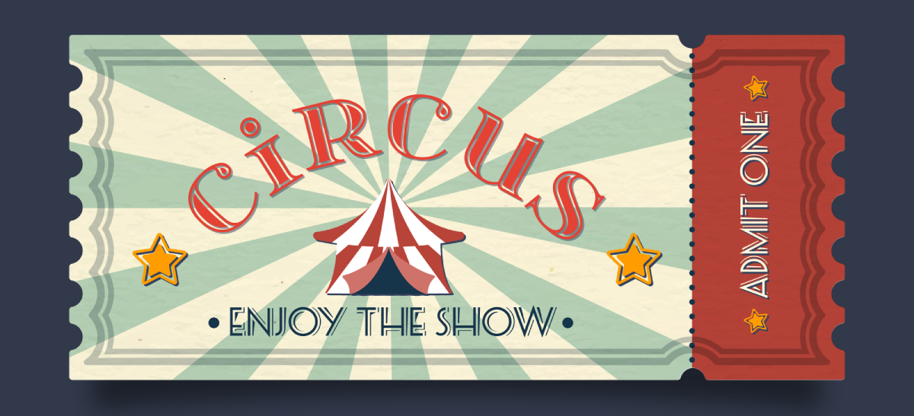

# Circus Kata 1: ShowScheduler

- **Open/Closed Principle**: las entidades deben estar abiertas para su extensión, pero cerradas para su modificación.
- **Interface Segregation Principle**: ninguna pieza de código debería verse obligada a depender de interfaces que no utiliza.
- **Liskov Substitution Principle**: una subclase debe poder sustituir a su superclase sin romper el programa.

En esta kata vamos a partir de dos clases:

### class `Show`

- Incumple el principio **Interface Segregation Principle (ISP)** porque permite modelar shows con propiedades que no son necesarias para todos los tipos de show.
- Incumple el principio **Open/Closed Principle (OCP)** porque no permite agregar nuevos tipos de shows sin modificar la clase Show.

### class `ShowScheduler`

- Incumple el principio **Open/Closed Principle (OCP)** porque no permite agregar nuevos tipos de shows sin modificar la clase ShowScheduler.

## Objetivo

El objetivo de esta kata es refactorizar las clases `Show` y `ShowScheduler` aplicando los principios de diseño **SOLID**, en particular el **Open/Closed Principle (OCP)** y el **Interface Segregation Principle (ISP)**.

Si aplicas herencia también tendrás que aplicar el - **Liskov Substitution Principle (LSP)**.

## Tests

Los tests están cubriendo las funcionalidades de los métodos `calculateTotalDuration` y `getShowDurationByName` de la clase `ShowScheduler`.

## Scripts

Recuerda instalar las dependencias desde esta carpeta con:

`npm install`

Para lanzar la compilación de TS:

`npm run build` (una vez)
`npm run build:dev` (modo watch)

Para lanzar los tests:

`npm test`
